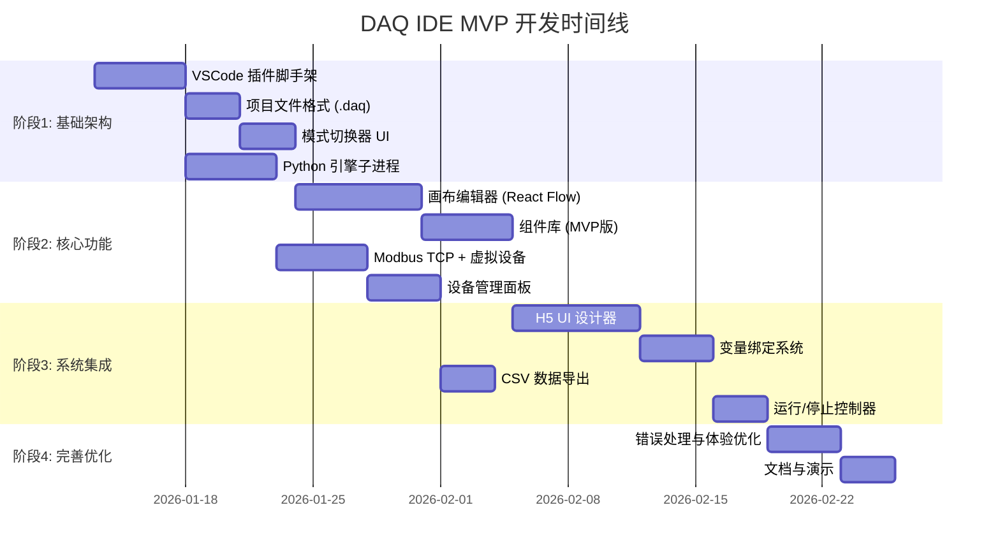

# DAQ IDE MVP 开发计划

> **版本**: 1.0  
> **日期**: 2026-01-12  
> **开发周期**: 9周 (约2个月)  
> **目标平台**: Windows 10/11, VSCode 插件

---

## 1. 项目概述

### 1.1 MVP 核心目标
| # | 目标 | 验收指标 |
|---|------|----------|
| 1 | **验证架构** | VSCode 插件加载成功，双模式 UI 正确渲染 |
| 2 | **验证闭环** | 设备 → 数据 → 处理 → UI → CSV 完整流程可用 |
| 3 | **验证体验** | 新用户 10 分钟内完成"温度监控"演示项目 |

### 1.2 技术栈
| 层级 | 技术选型 |
|------|----------|
| IDE 平台 | VSCode Extension API |
| LabVIEW 模式画布 | React + React Flow ✅ (已确认) |
| H5 UI 设计器 | Web Components / React + 拖拽库 |
| 后端引擎 | Python 3.11+ (子进程) |
| 设备协议 | Modbus TCP (pymodbus) |
| 数据存储 | CSV (pandas/内置) |
| AI 对话 | ❌ MVP 不实现 |

---

## 2. 阶段划分



---

## 3. 详细阶段计划

### 阶段1: 基础架构 (第1-3周)

| 任务ID | 任务 | 工期 | 依赖 | 交付物 |
|--------|------|------|------|--------|
| P1.1 | VSCode 插件脚手架 | 5天 | - | 插件激活，显示侧边栏 |
| P1.2 | 定义 `.daq` 项目格式 (JSON) | 3天 | P1.1 | Schema + 读写函数 |
| P1.3 | 模式切换器 (状态栏按钮) | 3天 | P1.1 | LabVIEW/QtCreator 视图切换 |
| P1.4 | Python 引擎子进程 | 5天 | P1.1 | `daq_core` 模块, stdio/JSON 通信 |

**里程碑1** ✅: 插件加载成功，模式切换可用，Python 引擎响应 ping 请求

---

### 阶段2: 核心功能 (第4-6周)

| 任务ID | 任务 | 工期 | 依赖 | 交付物 |
|--------|------|------|------|--------|
| P2.1 | 画布编辑器 (无限画布) | 7天 | P1.3 | React Flow 集成到 WebView |
| P2.2 | MVP 组件库 | 5天 | P2.1 | 8个节点: 3源+3处理+2汇 |
| P2.3 | Modbus TCP + 虚拟设备 | 5天 | P1.4 | `ModbusClient`, `VirtualDevice` 类 |
| P2.4 | 设备管理面板 | 4天 | P2.3 | 添加/删除设备，连接状态显示 |

**MVP 组件库详情**:
| 类别 | 组件 | 输入 | 输出 |
|------|------|------|------|
| 源 | `正弦波发生器` | 频率, 幅度 | Number |
| 源 | `随机数发生器` | 最小值, 最大值 | Number |
| 源 | `Modbus读取` | 设备ID, 寄存器地址 | Number |
| 处理 | `数学运算` (+,-,*,/) | a, b | Number |
| 处理 | `比较运算` (>,<,=) | a, b | Boolean |
| 处理 | `阈值报警` | 值, 阈值 | Boolean |
| 汇 | `调试打印` | 任意类型 | - |
| 汇 | `全局变量写入` | 值, 变量名 | - |

**里程碑2** ✅: 用户可拖拽节点到画布，完成连线，查看调试输出

---

### 阶段3: 系统集成 (第7-8周)

| 任务ID | 任务 | 工期 | 依赖 | 交付物 |
|--------|------|------|------|--------|
| P3.1 | H5 UI 设计器 | 7天 | P2.2 | WebView 中的拖拽式 UI 编辑器 |
| P3.2 | 变量绑定系统 | 4天 | P3.1, P2.4 | UI 控件绑定全局变量 |
| P3.3 | CSV 数据导出 | 3天 | P2.3 | 自动保存到 `data/*.csv` |
| P3.4 | 运行/停止控制器 | 3天 | P3.2 | 播放/暂停/停止按钮，状态机 |

**H5 UI 控件库 (MVP版)**:
| 类别 | 控件 | 可绑定属性 |
|------|------|------------|
| 显示类 | `数字显示框` | value |
| 显示类 | `LED指示灯` | state (布尔) |
| 显示类 | `实时波形图` | data 数组 |
| 控制类 | `开关按钮` | state |
| 控制类 | `数值输入框` | value |

**里程碑3** ✅: 完整演示流程可用 - 虚拟设备 → 画布 → UI → CSV

---

### 阶段4: 完善优化 (第9周)

| 任务ID | 任务 | 工期 | 依赖 | 交付物 |
|--------|------|------|------|--------|
| P4.1 | 错误处理与体验优化 | 4天 | P3.4 | Toast 通知，连接重试 |
| P4.2 | 文档与演示 | 3天 | P4.1 | README, 视频演示, 示例项目 |

**里程碑4** ✅: MVP 就绪，可进行内部测试

---

## 4. 架构规格

### 4.1 数据类型系统 (MVP)
| 类型 | JSON 表示 | 示例 |
|------|-----------|------|
| `Number` | `{"type": "number", "value": 42.5}` | 传感器读数 |
| `Boolean` | `{"type": "boolean", "value": true}` | 报警状态 |
| `String` | `{"type": "string", "value": "OK"}` | 状态信息 |
| `Array<Number>` | `{"type": "array", "items": [1,2,3]}` | 波形数据 |

### 4.2 Python 引擎 API (`daq_core`)
```python
class DAQCore:
    def connect_device(self, config: dict) -> bool      # 连接设备
    def read_register(self, device_id: str, addr: int) -> float  # 读寄存器
    def write_register(self, device_id: str, addr: int, value: float) -> bool  # 写寄存器
    def start_flow(self, flow_json: str) -> str         # 启动流程，返回 flow_id
    def stop_flow(self, flow_id: str) -> bool           # 停止流程
    def get_variable(self, name: str) -> Any            # 获取变量
    def set_variable(self, name: str, value: Any) -> None  # 设置变量
```

### 4.3 IPC 协议 (插件 ↔ Python)
- **传输方式**: stdio (stdin/stdout)
- **数据格式**: JSON-RPC 2.0
- **示例**:
```json
{"jsonrpc": "2.0", "method": "connect_device", "params": {"ip": "192.168.1.10", "port": 502}, "id": 1}
```

---

## 5. 验收计划

### 5.1 单元测试
| 组件 | 测试框架 | 命令 |
|------|----------|------|
| Python `daq_core` | pytest | `cd python && pytest tests/ -v` |
| VSCode 插件 | Mocha | `npm run test` |

### 5.2 集成测试
| 场景 | 步骤 | 预期结果 |
|------|------|----------|
| 虚拟设备流程 | 1.创建项目 2.添加虚拟设备 3.连接正弦波→调试打印 4.运行 | 控制台显示正弦值 |
| Modbus连接 | 1.启动Modbus模拟器 2.添加设备 3.读取寄存器 | 正确显示数值 |
| CSV导出 | 1.运行流程10秒 2.停止 3.检查data文件夹 | CSV文件存在且有时间戳 |

### 5.3 验收测试 (手动 - 10分钟演示)
1. 启动带有 DAQ 扩展的 VSCode
2. `Ctrl+Shift+P` → "DAQ: 新建项目" → 选择"基础数据采集"
3. 设备面板 → 添加"虚拟温度传感器"
4. LabVIEW 模式 → 拖入 `Modbus读取` → `比较(>30)` → `全局变量写入("alarm")`
5. UI 设计器 → 添加 `波形图` (绑定"temp") + `LED指示灯` (绑定"alarm")
6. 点击 **运行** → 观察图表更新，温度>30时LED变红
7. 点击 **停止** → 验证 `data/session_xxx.csv` 文件存在

---

## 6. 风险控制

| 风险 | 影响 | 应对措施 |
|------|------|----------|
| React Flow 学习曲线 | 中 | 使用官方示例，预留2天缓冲 |
| Python 子进程稳定性 | 高 | 实现心跳检测，崩溃自动重启 |
| Modbus 设备不可用 | 中 | 虚拟设备作为所有测试的备选 |
| AI API 速率限制 | 低 | AI 功能设为可选，后期添加本地模型 |

---

## 7. 已确认事项

- ✅ **React Flow** 作为画布编辑器技术选型
- ✅ **AI 对话功能**暂不实现，后续版本再添加
- ✅ 开发周期调整为 **9周**
