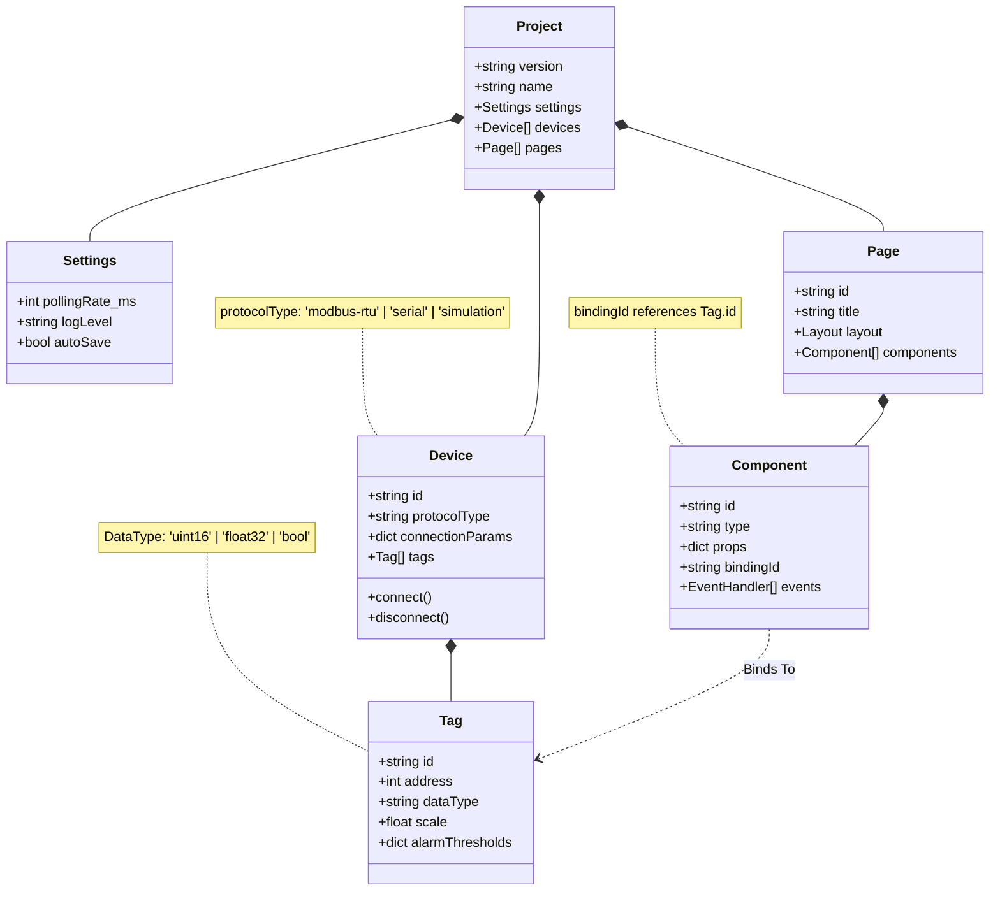
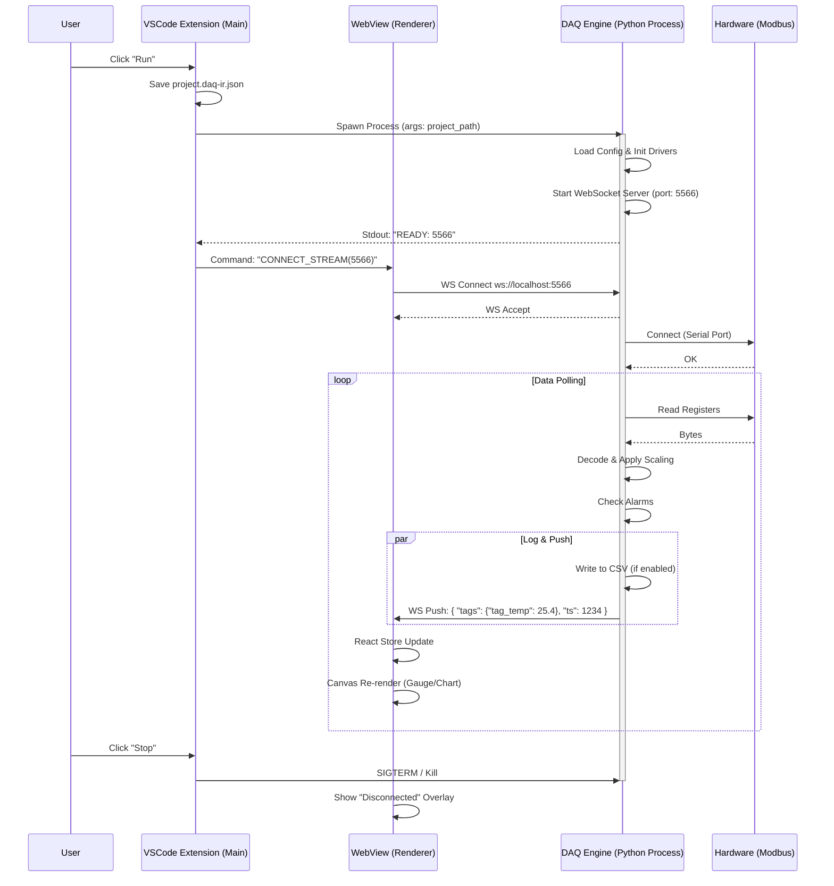

# DAQ 系统架构设计说明书 (Phase 1)
> **版本**: v0.5 (MetaGPT-Architect 生成版)  
> **生成策略**: 深度模仿 MetaGPT Architect Role 输出  
> **核心目标**: 定义 DAQ-IR (数据模型) 与 IPC (通信模型)

---

## 📂 1. 工程文件结构 (Project Structure)

本设计定义了用户创建一个 DAQ 项目时的物理文件布局。

```text
MyDAQProject/
├── .daq/                   # [Hidden] IDE 内部状态与缓存
│   ├── layout.json         # VSCode 面板布局状态
│   └── recent.cache        # 最近打开与编辑位置
├── assets/                 # [Resource] 静态资源
│   ├── images/             # 用户导入的背景图/Logo
│   └── drivers/            # (可选) 自定义设备驱动脚本
├── scripts/                # [Logic] 用户编写的逻辑脚本
│   └── process_data.py     # 数据处理钩子
├── logs/                   # [Runtime] 运行日志
│   ├── engine_stdout.log   # 引擎控制台输出
│   └── data_record.csv     # (MVP) 简单数据落盘
├── project.daq-ir.json     # [Core] 单一事实来源 (Single Source of Truth)
└── README.md               # 项目说明
```

---

## 🧩 2. 数据结构定义 (DAQ-IR Class Diagram)

**设计原则**: DAQ-IR (Intermediate Representation) 是完全与 UI 和 引擎解耦的 JSON 结构。前端只负责**渲染**它，引擎只负责**执行**它。



### 2.1 DAQ-IR JSON 片段示例
```json
{
  "devices": [{
    "id": "dev_01",
    "protocolType": "modbus-rtu",
    "connectionParams": { "port": "COM3", "baudrate": 9600 },
    "tags": [{ "id": "tag_temp", "address": 40001, "dataType": "uint16" }]
  }],
  "pages": [{
    "components": [{
      "type": "Gauge",
      "bindingId": "dev_01.tag_temp",
      "props": { "min": 0, "max": 100 }
    }]
  }]
}
```

---

## ⚡ 3. 程序调用流程 (IPC Sequence Flow)

**场景**: 用户点击“运行”按钮，系统从编辑态切换到运行态 (Start & Monitor)。

**通信架构决策**:
1.  **控制流 (Control)**: 使用 `Stdio` (标准输入输出) 或者 `JSON-RPC` over TCP。MVP 建议 Stdio 简单可靠。
2.  **数据流 (Data)**: 使用 `WebSocket` (Localhost)。引擎作为 WS Server，WebView 直接连接，**旁路掉** VSCode 主进程以保证 60FPS 渲染性能。



---

## 4. 关键接口定义 (API Signatures)

### 4.1 Engine 启动参数
```bash
python -m daq_engine --project "path/to/project.daq-ir.json" --port 5566 --headless
```

### 4.2 WebSocket 数据帧格式 (Engine -> UI)
为了极致性能，采用扁平化 JSON 数组或 Binary (Protobuf/MsgPack)。MVP 阶段使用紧凑 JSON。

**Format**: `[Timestamp, {TagID: Value, ...}]`
```json
// Example Frame
[1704874210500, {"dev_01.tag_temp": 24.5, "dev_01.tag_pressure": 101.3}]
```

## 5. 待确认细节 (To Be Clarified)

1.  **TagID 命名空间**: 建议使用 `DeviceID.TagID` 组合键，还是全局唯一 UUID？
    *   *Architect 建议*: 使用 `DeviceID.ChannelName` 作为用户可见键，内部使用 UUID 追踪重命名。
2.  **双向控制**: 如何从 UI 写入值（例如开关继电器）？
    *   *Architect 建议*: UI 通过 WebSocket 发送 `{"cmd": "write", "tag": "...", "val": 1}`，Engine 在下一个循环周期处理写入。

---
